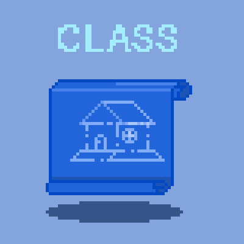
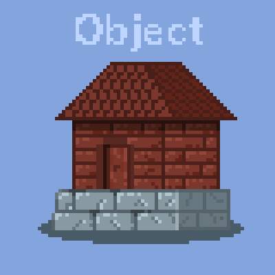

# Modul-1

## OOP (Object Oriented Programming)
1.Class
2.Object
3.Inheritance
4.Polymorph

### Class

Class adalah sebuah definisi dari sebuah objek, bisa dianalogikan dengan blueprint.

### Object

Object adalah implementasi dari sebuah Class

### Inheritance 

Inheritance adalah konsep penurunan sifat dari _Parent class_ ke _child class_ 

### PolyMorphism

Polymorphism adalah konsep perubahan bentuk (tergantung sudut pandang) sebuah objek

### Interfaces

Interface adalah konsep untuk mempermudah komunikasi antar class/object/program

## Lets Make Top Down Shooter !!!

### Start from basic (Player Movement)

