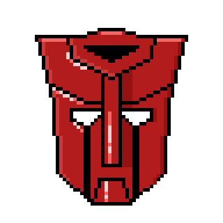
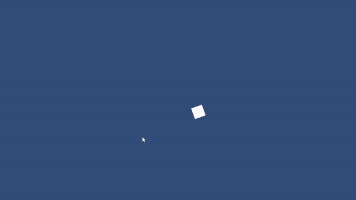

# Modul-1

## OOP (Object Oriented Programming)
1. Class
2. Object
3. Inheritance
4. Polymorph

### Class

Class adalah sebuah definisi dari sebuah objek, bisa dianalogikan dengan blueprint.


### Object

Object adalah implementasi dari sebuah Class


### Inheritance 

Inheritance adalah konsep penurunan sifat dari _Parent class_ ke _child class_ 


### PolyMorphism

Polymorphism adalah konsep perubahan bentuk (tergantung sudut pandang) sebuah objek



### Interfaces

Interface adalah konsep untuk mempermudah komunikasi antar class/object/program


## Lets Make Top Down Shooter !!!

### Start from basic (Player Movement)



### 1. prepare assets (untuk placeholder)
   1. new file di aplikasi Aseprite
   2. pilih canvas size 1x1
   3. beri warna putih
   4. export as png
   5. copy hasil export (file png) ke folder Assets/Sprites
   6. klik gambar 1px.png di tab project Assets/Sprites/1px.png
   7. di tab inspector ubah nilai pixel per unit menjadi 1  
   8. ubah filter mode menjadi "point (no filter)"
   9. ubah compression menjadi (none)
   10. kemudian apply
  
### 2. prepare the object
  1. di tab hierarchy klik kanan dan "create empty" lalu beri nama "Player"
  2. di gameobject "Player" Add Component "Sprite Renderer"
  3. drag and drop 1px.png ke row dengan label Sprite
  4. add component Rigidbody2D lalu ubah gravity scale ke 0

### 3. add Scripts for movement
  1. di Assets create folder bernama Scripts
  2. create add C# scripts bernama Player
  3. add atribute rigidbody pada class
     ```c#
     private RigidBody2D _rigidbody;
     ```
     
  4. inisialisasi \_rigidbody di dalam function start
     ```c#
     void Start()
     {
        _rigidbody = GetComponent<Rigidbody2D>();
     }
     ```
     
  5. add atribute \_movement
     ```c#
     //tambah atribut pada
     private Vector2 _movement;
     [SerializeField] private float speed;
     ```
     
  6. update input keboard
     ```c#
     void Update()
     {
        _movement.x = Input.GetAxisRaw("Horizontal"); // antara -1, 0, 1
        _movement.y = Input.GetAxisRaw("Vertical");
     }
     ```
  7. update velocity pada function FixedUpdate() agar player bisa berubah position
     ```c#
     private void FixedUpdate()
     {
        _rigidbody.velocity = new Vector2(_movement.x * speed, _movement.y * speed);
     }
     ```
  8. di unity editor drag and drop scripts ke game object player
  9. ganti atribut speed pada editor menjadi 5 (atau sesuka kalian)
### 4. rotation Player
  1. add attribute \_mousePos dan camera
     ```c#
     private Vector2 _mousePos;
     [SerializeField] private Camera cam;
     ```
  2. update posisi mouse pada function update
     ```c#
     _mousePos = cam.ScreenToWorldPoint(Input.mousePosition);
     ```
  3. update rotation player pada function Fixed Update
     ```c#
     Vector2 lookDirection = _mousePos - _rigidbody.position;

     float angle = Mathf.Atan2(lookDirection.y, lookDirection.x) * Mathf.Rad2Deg - 90;

     _rigidbody.rotation = angle;
     ```
  4. di unity editor jangan lupa drag MainCamera kedalam script dengan atribut Cam

     
