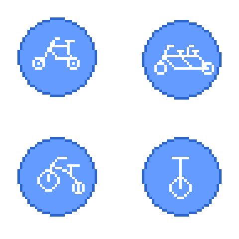

# Modul-1

## OOP (Object Oriented Programming)
1. Class
2. Object
3. Inheritance
4. Polymorph

### Class

Class adalah sebuah definisi dari sebuah objek, bisa dianalogikan dengan blueprint.

### Object

Object adalah implementasi dari sebuah Class

### Inheritance 

Inheritance adalah konsep penurunan sifat dari _Parent class_ ke _child class_ 

### PolyMorphism

Polymorphism adalah konsep perubahan bentuk (tergantung sudut pandang) sebuah objek

### Interfaces

Interface adalah konsep untuk mempermudah komunikasi antar class/object/program

## Lets Make Top Down Shooter !!!

### Start from basic (Player Movement)

### 1. prepare assets (untuk placeholder)
   1. new file di aplikasi Aseprite
   2. pilih canvas size 1x1
   3. beri warna putih
   4. export as png
   5. copy hasil export (file png) ke folder Assets/Sprites
   6. klik gambar 1px.png di tab project Assets/Sprites/1px.png
   7. di tab inspector ubah nilai pixel per unit menjadi 1  
   8. ubah filter mode menjadi "point (no filter)"
   9. ubah compression menjadi (none)
   10. kemudian apply
  
### 2. prepare the object
  1. di tab hierarchy klik kanan dan "create empty" lalu beri nama "Player"
  2. di gameobject "Player" Add Component "Sprite Renderer"
  3. drag and drop 1px.png ke row dengan label Sprite
  4. add component Rigidbody2D lalu ubah gravity scale ke 0

